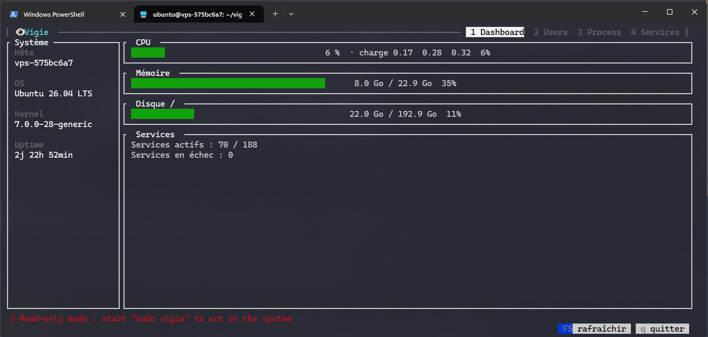

# ◉ Vigie

**Gérer un serveur Linux depuis une seule fenêtre de terminal.**

Vigie est une interface en mode texte (TUI) qui regroupe au même endroit ce qu'on fait habituellement avec une dizaine de commandes : surveiller la machine, gérer les comptes utilisateurs, surveiller les processus et piloter les services systemd. Pas de navigateur, pas d'agent à installer, pas de port à ouvrir : un seul binaire, lancé en SSH.


---

## Fonctionnalités

### Tableau de bord
- Jauges **CPU**, **mémoire** et **disque** (`/`), colorées selon le niveau de charge (vert, jaune ≥ 70 %, rouge ≥ 90 %)
- Charge moyenne (load average)
- Nombre de services actifs et liste des **services en échec**

### Utilisateurs
- Liste des comptes humains (root et UID ≥ 1000) : UID, shell, groupes, droits admin, état verrouillé ou actif
- **Créer** un utilisateur (avec son dossier personnel)
- **Changer le mot de passe**
- **Verrouiller / déverrouiller** un compte
- **Donner / retirer les droits admin** (groupe `sudo` ou `wheel`, détecté automatiquement selon la distribution)
- **Supprimer** un utilisateur et son dossier

### Processus
- Processus triés par consommation CPU : PID, utilisateur, CPU %, RAM %, mémoire
- **Arrêt propre** (SIGTERM) ou **arrêt forcé** (SIGKILL)

### Services
- Tous les services systemd, ceux en échec en premier
- État actuel et état au démarrage
- **Démarrer / arrêter / redémarrer**
- **Activer / désactiver au démarrage**

### Pour tous les écrans
- Rafraîchissement automatique toutes les 2 secondes, **sans bloquer le clavier**
- **Confirmation obligatoire** (`o` / `n`) avant toute action qui modifie le système
- **Mode lecture seule** automatique quand Vigie n'est pas lancé en root
- Panneau système permanent : hôte, OS, noyau, uptime

---

## Installation

### Prérequis
- Linux avec **systemd**
- [Dart SDK](https://dart.dev/get-dart) ≥ 3.3, uniquement pour compiler

### Installation (Debian / Ubuntu)

```bash
sudo install -d -m 0755 /etc/apt/keyrings
curl -fsSL https://vigie.elnuagee.fr/nuage-apt.gpg | sudo tee /etc/apt/keyrings/nuage-apt.gpg >/dev/null
echo "deb [signed-by=/etc/apt/keyrings/nuage-apt.gpg] https://vigie.elnuagee.fr stable main" \
  | sudo tee /etc/apt/sources.list.d/nuage.list
sudo apt update && sudo apt install vigie
```

Mises à jour : `sudo apt update && sudo apt upgrade`.

```bash
curl -L -o vigie https://github.com/nuageeee/vigie/releases/latest/download/vigie-linux-x64
sudo install -m 755 vigie /usr/local/bin/vigie
```

### Compiler et installer

```bash
git clone https://github.com/nuageeee/vigie.git
cd vigie
dart pub get
dart compile exe bin/vigie.dart -o vigie
sudo install -m 755 vigie /usr/local/bin/vigie
```

Le binaire obtenu est **autonome** : vous pouvez le copier sur n'importe quel serveur Linux de même architecture, sans installer Dart dessus.

```bash
scp vigie mon-serveur:/tmp/ && ssh mon-serveur 'sudo install -m 755 /tmp/vigie /usr/local/bin/'
```

---

## Utilisation

```bash
vigie          # consultation seule
sudo vigie     # consultation + actions (créer un compte, redémarrer un service…)
sudo vigie --no-mouse # consultation + actions sans support de la souris
```

### Raccourcis clavier

| Où | Touche | Action |
|---|---|---|
| Partout | `1` à `4` | Changer de section |
| | `↑` `↓` / `j` `k` | Naviguer dans la liste |
| | `F5` | Tout rafraîchir |
| | `q` | Quitter |
| Confirmation | `o` / `n` (ou `Échap`) | Valider / annuler |
| Saisie | `Entrée` / `Échap` | Valider / annuler |
| **Utilisateurs** | `a` | Ajouter un utilisateur |
| | `p` | Changer le mot de passe |
| | `v` | Verrouiller / déverrouiller |
| | `g` | Donner / retirer les droits admin |
| | `D` | Supprimer (avec son dossier) |
| **Processus** | `t` | Arrêt propre (SIGTERM) |
| | `K` | Arrêt forcé (SIGKILL) |
| **Services** | `s` | Démarrer |
| | `x` | Arrêter |
| | `r` | Redémarrer |
| | `e` | Activer au démarrage |
| | `d` | Désactiver au démarrage |

> ⚠️ Connecté en SSH, éviter d'arrêter `ssh.service` : vous perdrez l'accès au serveur.


### Options

| Option | Effet |
|---|---|
| `--no-mouse` | Désactive la souris (utile dans tmux sans `mouse on`, ou pour sélectionner du texte) |

> 💡 Souris active : maintiens `Maj` pour sélectionner du texte dans le terminal.

## Développement

### Lancer depuis les sources

```bash
dart pub get                              # sans sudo
dart run bin/vigie.dart                   # lecture seule
sudo "$(which dart)" run bin/vigie.dart   # avec les droits root
```

`sudo dart` seul ne fonctionne pas : `sudo` utilise son propre `PATH` (`secure_path`), qui ne contient pas Dart. Ne lancer pas non plus `dart pub get` avec `sudo`, sinon `.dart_tool/` appartient à root.

### Hot reload

Avec le package [`hotreloader`](https://pub.dev/packages/hotreloader) (en dev dependency), les modifications dans `lib/` s'appliquent sans relancer Vigie :

```bash
dart run --enable-vm-service bin/vigie.dart --no-session
```
> ⚠️ L'option "--no-session" est obligatoire en mode dév et hot-reload. 
 
Se recharge à chaud : l'interface, les raccourcis, les commandes système.
Demande de relancer : `bin/vigie.dart`, les paramètres de `runTerminal`, un nouveau champ dans l'état, une modification de l'`enum` des sections.

### Architecture

```
bin/vigie.dart            Point d'entrée : détection root, lancement plein écran, restauration du terminal
lib/src/state.dart        Tout l'état de l'application (section, données, confirmation, saisie)
lib/src/events.dart       Gestion du clavier → modifie l'état
lib/src/ui/               Rendu uniquement, ne lance jamais de commande
  layout.dart             Barre d'onglets, panneau système, barre d'état, boutons
  dashboard.dart          Jauges et résumé
  tables.dart             Tableaux utilisateurs / processus / services
  prompt.dart             Fenêtre de saisie
lib/src/system/           Accès au système uniquement → renvoie des objets Dart simples
  shell.dart              Lancement de commandes, lecture de fichiers
  overview.dart           /proc/stat, /proc/meminfo, df, uptime, os-release
  users.dart              /etc/passwd, /etc/group, /etc/shadow, useradd, usermod…
  processes.dart          ps, kill
  services.dart           systemctl
```

Le principe : `render` redessine **tout** l'écran à partir de l'état (rendu en mode immédiat, via [commander_ui](https://pub.dev/packages/commander_ui)). L'interface ne parle jamais directement au système : tout passe par `lib/src/system/`.

### D'où viennent les données

| Donnée | Source |
|---|---|
| CPU | `/proc/stat` (écart entre deux lectures) |
| Mémoire | `/proc/meminfo` (`MemTotal`, `MemAvailable`) |
| Disque | `df -Pk /` |
| Uptime, charge | `/proc/uptime`, `/proc/loadavg` |
| OS | `/etc/os-release` |
| Utilisateurs | `/etc/passwd`, `/etc/group`, `/etc/shadow` (root) |
| Processus | `ps -eo pid,ppid,user,pcpu,pmem,rss,comm` |
| Services | `systemctl list-units` + `systemctl list-unit-files` |

---

## Feuille de route

- [x] Support de la souris (onglets, lignes et boutons cliquables, molette)
- [x] Lancement au démarrage: ce lance a l'ouverture d'une session (Si activé)
- [x] Terminal intégré 
- [x] CPU instantané par processus via `/proc/<pid>/stat` (le `%CPU` de `ps` est une moyenne sur la vie du processus)
- [ ] Recherche / filtre avec `/`
- [ ] Journal d'un service (`journalctl -u`)/
- [ ] Mode distant : gérer plusieurs serveurs via SSH

---

## Construit avec

- [Dart](https://dart.dev)
- [commander_ui](https://pub.dev/packages/commander_ui) pour l'interface terminal

## Licence

Distribué sous licence [MIT](LICENSE).